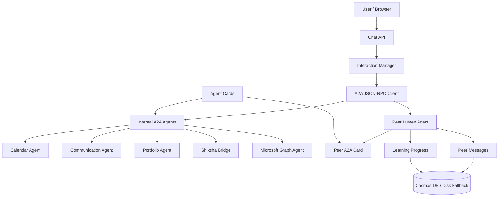

# Lumen A2A Progress Explainer

## Purpose

This document explains the current A2A implementation in Lumen from a progress and demo-readiness point of view. It covers what is already working, how agent discovery happens, how cards are exposed, how agents are identified by URL, and how Lumen-to-Lumen communication works.

## Current Status

The project has a working A2A layer for both specialist agents and peer Lumens.

Specialist agents are exposed through JSON-RPC endpoints such as:

- `/a2a/calendar`
- `/a2a/communication`
- `/a2a/portfolio`
- `/a2a/shiksha`
- `/a2a/graph`

Every signed-in user also has a personal Lumen endpoint:

- `/a2a/lumen/{user_id}`

That means Lumen supports two kinds of agent-to-agent interaction:

- Lumen to specialist agent, for tasks like calendar, communication, portfolio, Shiksha, and Microsoft Graph.
- Lumen to peer Lumen, for messaging, study scheduling, reminders, and information requests.

## Architecture Flow

The high-level flow is:

1. User sends a message through the chat interface.
2. The backend interaction manager decides which capability should handle it.
3. The shared A2A client sends a JSON-RPC `tasks/send` call.
4. The matching A2A endpoint receives the request.
5. The endpoint routes the task to the correct handler.
6. The handler returns a completed task artifact.
7. The response includes both plain text and structured JSON.
8. The frontend can render the structured data as cards, actions, or UI surfaces.

## Main Files To Show

Open these files while explaining the implementation:

1. `app/main.py` - starts the app, mounts A2A routes, exposes the system card and public directory.
2. `app/protocols/models.py` - defines the A2A card shape.
3. `app/protocols/a2a.py` - handles `/a2a/{agent_id}` JSON-RPC calls.
4. `app/agents/a2a_client.py` - sends A2A JSON-RPC calls from one agent to another.
5. `app/protocols/lumen_a2a.py` - exposes each user Lumen as a peer A2A agent.
6. `app/routes/lumen_social.py` - peer discovery, peer cards, and peer message flow.
7. `app/lumen/core.py` - persistent Lumen identity and learning progress state.
8. `app/db/cosmos.py` - storage containers for Lumens, messages, progress, and agent records.
9. `app/agents/calendar_agent.py` - Calendar Agent card and skills.
10. `app/agents/communication_agent.py` - Communication Agent card and skills.
11. `app/agents/portfolio_agent.py` - Portfolio Agent card and skills.
12. `app/agents/shiksha_agent.py` - Shiksha Bridge card and skills.
13. `app/agents/graph_agent.py` - Microsoft Graph Agent card and skills.

## Card-Based Discovery

Discovery happens through public cards. A card tells other systems:

- The agent name.
- What the agent does.
- Which URL accepts A2A JSON-RPC calls.
- Which skills the agent supports.
- What input and output modes it accepts.
- Which security schemes are expected.

The card model is defined in `app/protocols/models.py`.

```python
class AgentInterface(BaseModel):
    url: str
    protocolBinding: str = "JSONRPC"
    protocolVersion: str = "1.0"

class AgentSkill(BaseModel):
    id: str
    name: str
    description: str
    tags: list[str] = []
    examples: list[str] = []
    inputModes: list[str] = []

class AgentCard(BaseModel):
    name: str
    description: str
    version: str = "1.0.0"
    documentationUrl: str = ""
    provider: AgentProvider
    supportedInterfaces: list[AgentInterface]
    capabilities: AgentCapabilities
    defaultInputModes: list[str] = ["text/plain"]
    defaultOutputModes: list[str] = ["text/plain"]
    securitySchemes: dict = {}
    securityRequirements: list[dict] = []
    skills: list[AgentSkill] = []
```

The key field is `supportedInterfaces`. That is where the callable A2A URL is advertised.

## System Card

The top-level system card is exposed at:

```text
/.well-known/agent-card.json
```

Relevant code from `app/main.py`:

```python
@app.get("/.well-known/agent-card.json")
async def lumen_system_card(request: Request):
    base = str(request.base_url).rstrip("/")
    return {
        "name": "Lumen",
        "provider": {"organization": "Lumen Network", "url": base},
        "supportedInterfaces": [
            {
                "url": f"{base}/a2a/lumen",
                "protocolBinding": "JSONRPC",
                "protocolVersion": "1.0",
            }
        ],
        "capabilities": {
            "streaming": True,
            "pushNotifications": False,
            "extendedAgentCard": True,
        },
    }
```

This card is the entry point for explaining Lumen as a multi-agent system.

## Specialist Agent Cards

Each specialist agent owns its own card through a `get_agent_card()` function.

Calendar example from `app/agents/calendar_agent.py`:

```python
return AgentCard(
    name="Calendar Agent",
    description="Study plan generation, event scheduling, and calendar management.",
    provider=AgentProvider(organization="Lumen Network", url=base_url),
    supportedInterfaces=[AgentInterface(url=f"{base_url}/a2a/calendar")],
    capabilities=AgentCapabilities(streaming=False, pushNotifications=True),
    defaultInputModes=["text/plain"],
    defaultOutputModes=["text/plain", "application/json"],
    skills=[
        AgentSkill(
            id="calendar.generate_study_plan",
            name="Generate Study Plan",
            description="Generate a personalized weekly study plan.",
        ),
        AgentSkill(
            id="calendar.schedule_event",
            name="Schedule Event",
            description="Schedule a study session or calendar event.",
        ),
        AgentSkill(
            id="calendar.get_events",
            name="Get Events",
            description="Retrieve upcoming study sessions and events.",
        ),
    ],
)
```

The same pattern exists for:

- Communication Agent: `/a2a/communication`
- Portfolio Agent: `/a2a/portfolio`
- Shiksha Bridge: `/a2a/shiksha`
- Microsoft Graph Agent: `/a2a/graph`

## Agent URL Identity

For built-in specialist agents, identity is simple:

| Agent | A2A URL | Card URL |
| --- | --- | --- |
| Calendar Agent | `/a2a/calendar` | `/agents/calendar/agent-card.json` |
| Communication Agent | `/a2a/communication` | `/agents/communication/agent-card.json` |
| Portfolio Agent | `/a2a/portfolio` | `/agents/portfolio/agent-card.json` |
| Shiksha Bridge | `/a2a/shiksha` | `/agents/shiksha/agent-card.json` |
| Microsoft Graph Agent | `/a2a/graph` | `/agents/graph/agent-card.json` |

For peer Lumens, the addressable A2A endpoint is:

```text
/a2a/lumen/{user_id}
```

The peer's card URL is:

```text
/a2a/lumen/{user_id}/agent-card.json
```

The protocol-level Lumen identity is stored as `lumen_id`.

```python
return {
    "id": user_id,
    "lumen_id": f"lumen://{kwargs.get('tenant_id', 'default')}/{user_id}",
    "name": name,
    "email": email,
    "social": {"discoverable": True, "share_progress": True},
}
```

## A2A Request Flow

The shared client in `app/agents/a2a_client.py` sends `tasks/send`.

```python
base = (base_url or settings.app_base_url or "http://localhost:8000").rstrip("/")
endpoint = f"{base}{agent_path}"

params = {
    "message": {"parts": [{"type": "text", "text": message}]},
    "metadata": {
        "user": {
            "id": user_id,
            "name": user_name,
        }
    },
}

body = {
    "jsonrpc": "2.0",
    "id": str(uuid.uuid4())[:8],
    "method": "tasks/send",
    "params": params,
}
```

The endpoint receives it in `app/protocols/a2a.py`.

```python
@router.post("/a2a/{agent_id}")
async def a2a_jsonrpc(agent_id: str, body: dict):
    req_id = body.get("id")
    method = body.get("method")
    params = body.get("params") or {}

    if method == "tasks/send":
        result = await _handle_tasks_send(agent_id, params)
    elif method == "tasks/get":
        result = await _handle_tasks_get(params)
    elif method == "tasks/cancel":
        result = await _handle_tasks_cancel(params)
    else:
        return _rpc_error(req_id, -32601, f"Method not found: {method}")

    return _rpc_ok(req_id, result)
```

The task is completed with a dual artifact:

```python
def _complete_with_result(task: dict, result: dict) -> dict:
    text = (result or {}).get("reply", "")
    return _transition(task, "completed", artifact={
        "name": "reply",
        "parts": [
            {"type": "text", "text": text},
            {"type": "application/json", "data": result or {}},
        ],
    })
```

The text part is useful for generic A2A callers. The JSON part is useful for Lumen because it can contain cards, actions, redirects, proposals, or UI data.

## Peer Lumen Discovery

Peer discovery is implemented in `app/routes/lumen_social.py`.

```python
@router.get("/discover")
async def discover_peers(current_user: dict = Depends(get_current_user)):
    my_lumen = await get_lumen(current_user["id"])
    if not my_lumen:
        return {"peers": [], "count": 0, "protocol": "litp/1.0"}

    all_lumens = await get_all_lumens_full()
    peers = []
    for lumen in all_lumens:
        if lumen["id"] == current_user["id"]:
            continue
        if not lumen.get("social", {}).get("discoverable", True):
            continue
        summary = _anonymize_peer(lumen)
        summary["card"] = build_lumen_card(lumen)
        peers.append(summary)

    return {"peers": peers, "count": len(peers), "protocol": "litp/1.0"}
```

This endpoint returns only discoverable peers. Each result includes a public peer card.

## Peer Lumen Card

The peer card explains what a Lumen peer can receive.

```python
def build_lumen_card(lumen: dict) -> dict:
    return {
        "id": lumen["id"],
        "lumen_id": lumen.get("lumen_id", f"lumen://default/{lumen['id']}"),
        "name": lumen.get("name", "Student"),
        "type": "lumen",
        "protocol": "litp/1.0",
        "endpoint": f"/lumen/connect/{lumen['id']}",
        "card_url": f"/lumen/cards/{lumen['id']}",
        "discoverable": lumen.get("social", {}).get("discoverable", True),
        "capabilities": {
            "subjects": subjects,
            "tcs_mastered": mastered_ids,
            "can_receive": ["message", "compare"],
        },
    }
```

There is also a standards-oriented peer A2A card in `app/protocols/lumen_a2a.py`.

```python
@router.get("/a2a/lumen/{user_id}/agent-card.json")
async def lumen_a2a_card_v2(user_id: str, request: Request):
    lumen = await get_lumen(user_id)
    if not lumen:
        lumen = {"id": user_id, "name": "Student"}
    base_url = str(request.base_url).rstrip("/")
    return build_lumen_a2a_card(lumen, base_url)
```

The peer A2A card advertises:

- `message`
- `schedule_meeting`
- `info_request`
- `remind`

## Lumen-To-Lumen Messaging Progress

The project already supports real Lumen-to-Lumen message delivery through A2A.

In `app/agents/interaction_manager.py`, the sender's Lumen calls the receiver's Lumen endpoint:

```python
result = await a2a_tasks_send(
    agent_path=f"/a2a/lumen/{peer['id']}",
    message=body_text,
    user_id=user_id,
    user_name=sender_name,
    skill="message",
)
```

In `app/protocols/lumen_a2a.py`, the receiver handles the A2A request:

```python
if skill_id == "message":
    result = await _handle_a2a_message(
        user_id,
        target_name,
        sender_id,
        sender_name,
        text,
    )
elif skill_id == "schedule_meeting":
    result = await _handle_a2a_schedule(...)
elif skill_id == "info_request":
    result = await _handle_a2a_info_request(...)
elif skill_id == "remind":
    result = await _handle_a2a_remind(...)
```

The message is persisted as a peer message:

```python
msg = {
    "id": str(uuid.uuid4())[:8],
    "kind": "chat",
    "from_id": sender_id,
    "from_name": sender_name,
    "to_id": user_id,
    "to_name": target_name,
    "message": text,
    "read": False,
    "protocol": "litp/1.0",
    "created_at": datetime.now(UTC).isoformat(),
}
await _persist_peer_message(msg)
```

## Progress Tracking

Lumen stores learning state in each user's Lumen document.

The default Lumen object includes:

```python
"curriculum_progress": {},
"tc_inventory": {
    "mastered": [],
    "in_progress": [],
},
"session_history": [],
"artifacts": [],
"social": {"discoverable": True, "share_progress": True},
```

This lets the system connect A2A interactions with learning progress:

- Specialist agents can update progress after learning sessions.
- Peer discovery can show subjects and shared learning areas.
- Peer cards can advertise mastered threshold concepts.
- Scheduling can use weak areas or active concepts to propose study plans.

## Storage Status

The project uses Cosmos DB when configured and falls back to disk/in-memory storage for local or demo runs.

Relevant code from `app/db/cosmos.py`:

```python
CONTAINERS = {
    "lumens": "/id",
    "chat_threads": "/user_id",
    "graph_tokens": "/id",
    "peer_messages": "/channel_id",
    "agents": "/id",
}
```

The important storage areas for this flow are:

- `lumens` - persistent user Lumen state, identity, progress, and social settings.
- `peer_messages` - Lumen-to-Lumen messages.
- `chat_threads` - user chat history.
- `graph_tokens` - Microsoft Graph delegated tokens.

## Demo Script

Use this order to explain the system:

1. Start with the architecture diagram.
2. Show the system card at `/.well-known/agent-card.json`.
3. Show a specialist card such as `/agents/calendar/agent-card.json`.
4. Point out `supportedInterfaces` and the `/a2a/calendar` URL.
5. Show the shared A2A client building `tasks/send`.
6. Show `/a2a/{agent_id}` receiving JSON-RPC.
7. Show the dual response artifact with text plus JSON.
8. Show peer discovery in `/lumen/discover`.
9. Show a peer card and the `/a2a/lumen/{user_id}` endpoint.
10. Show a Lumen-to-Lumen message being sent and persisted.

## What Is Working

- Specialist agents expose A2A cards.
- Specialist agents accept JSON-RPC `tasks/send`.
- The shared client can call any internal or peer A2A endpoint.
- Responses include both text and structured JSON.
- Every user has a Lumen identity.
- Discoverable peers can be listed.
- Peer cards expose addressable capabilities.
- Lumen-to-Lumen messages are delivered through A2A.
- Learning progress is stored with the user's Lumen state.

## Short Explanation

Lumen is already structured as a multi-agent system. Each capability exposes a card that describes what it can do and where it can be called. The actual call uses JSON-RPC `tasks/send`. Built-in specialist agents use paths like `/a2a/calendar`, while each user has a peer Lumen endpoint like `/a2a/lumen/{user_id}`. Discovery happens by reading cards and peer lists. Execution happens through A2A tasks. Results come back as artifacts with plain text for compatibility and structured JSON for Lumen's UI.
