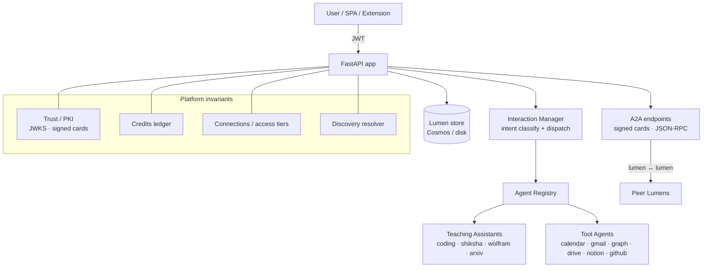

# Lumen

**Lumen is a persistent, person-centric AI agent platform.** Every user gets their
own *Lumen* — a long-lived personal agent that remembers their learning state,
routes work to specialist Teaching Assistants (TAs) and tool agents, manages
their schedule and communications, and talks to other people's Lumens over an
open agent-to-agent (A2A) protocol.

Each Lumen is addressable by a human-readable handle (`{username}`), describes
itself with a **signed, verifiable agent card**, gates conversation behind
**consented connections**, and meters compute against a **credit ledger** —
following the [Lumen System Design](Lumen_System_Design.md) invariants.

---

## Table of contents

- [Highlights](#highlights)
- [Architecture](#architecture)
- [Core platform capabilities](#core-platform-capabilities)
- [Agents & Teaching Assistants](#agents--teaching-assistants)
- [Integrations](#integrations)
- [API surface](#api-surface)
- [Project layout](#project-layout)
- [Getting started](#getting-started)
- [Configuration](#configuration)
- [Deployment](#deployment)
- [Browser extension](#browser-extension)

---

## Highlights

| Area | What it does |
|------|--------------|
| **Persistent Lumen** | Per-user agent state: identity, learning progress, threshold-concept inventory, session history, artifacts, preferences. Backed by Cosmos DB with a disk/in-memory fallback. |
| **Multi-agent orchestration** | A central interaction manager classifies intent (LLM-primary) and dispatches to specialist agents through a modular registry. |
| **A2A protocol** | Each Lumen and each tool agent is exposed as an A2A v1.0.0 JSON-RPC agent with a discoverable, **signed** agent card. |
| **Trust / PKI** | Platform signing key, JWKS endpoint, and detached-JWS card signing so cards are verifiable and tamper-evident. |
| **Connections & privacy** | Two-tier access: public profile is open; conversation and private profile require an accepted connection. |
| **Credits & metering** | Every metered LLM call charges the owning Lumen; an append-only ledger records who paid, how much, and why. |
| **Discovery** | Name resolution returns ranked candidate handles (in-context → verified → deterministic). |
| **Specialist TAs** | Coding, math (Wolfram), research (arXiv), and Shiksha/Ekalaiva course bridges. |
| **Productivity integrations** | Microsoft Graph (Outlook mail/calendar), Gmail, Google Calendar/Drive, Notion, GitHub & GitHub Classroom. |

---

## Architecture



- **Auth** lives in `app/auth/` as FastAPI dependencies (not middleware): Entra ID
  and Google OAuth, issuing a Lumen JWT.
- **Persistence** is `app/lumen/core.py` + `app/db/cosmos.py`; when Cosmos isn't
  configured it transparently falls back to a JSON file on disk.
- **Orchestration** is `app/agents/interaction_manager.py` driving the modular
  `AgentRegistry` (`app/agents/base.py`).
- **v2** (`/v2`) is an additive Magentic-One orchestration runtime mounted
  defensively so it can never break v1.

---

## Core platform capabilities

These implement the [system design](Lumen_System_Design.md) invariants.

### Trust / PKI — signed agent cards
`app/lumen/trust.py`
- Platform RSA signing key (auto-generated, persisted, `kid` via RFC 7638 thumbprint).
- Public key set served at **`GET /.well-known/jwks.json`**.
- `sign_card()` / `verify_card()` produce and check a **detached JWS** (RFC 7515).
  The system card and every per-Lumen A2A card are signed; any edit breaks the
  signature ("authority from the source").

### Economics — credit balance + append-only ledger
`app/lumen/credits.py`
- Each account holds a USD-equivalent credit balance with a signup grant.
- `charge` / `grant` / `ensure_can_spend`; overdraws are refused when
  `LUMEN_ENFORCE_CREDITS` is enabled.
- The token tracker (`app/lumen/token_tracker.py`) debits the **owner of the
  Lumen that generated the work** on every metered LLM call — *you pay for your
  own Lumen's compute*. Humans typing into a conversation are free.

### Access control — connections & two tiers
`app/lumen/connections.py`
- Connection lifecycle: `request → pending → accept / reject / block`, mirrored
  on both Lumens; `is_connected()` gate.
- **Tier 1 (public):** anyone may view a Lumen's public profile and signed card.
- **Tier 2 (connected):** conversation and private profile detail unlock only
  after an accepted connection. Enforced on the A2A endpoint via
  `LUMEN_ENFORCE_CONNECTIONS`.

### Discovery — name resolution
`app/routes/lumen_platform.py`
- **`GET /lumen/resolve`** returns ranked candidate handles for a display name:
  in-context (same org) first, then verified, then deterministic. This is name
  resolution, **not** capability search.

---

## Agents & Teaching Assistants

| Agent | Module | Purpose |
|-------|--------|---------|
| Interaction Manager | `app/agents/interaction_manager.py` | Intent classification + dispatch to specialists |
| Coding TA | `app/agents/coding_ta.py` | Solve, explain, hint, and give feedback on coding problems |
| Shiksha TA | `app/agents/shiksha_agent.py` | Course content, quizzes, learning paths (Shiksha/Ekalaiva) |
| Wolfram | `app/agents/wolfram_agent.py` | Math, physics, and data queries via Wolfram Alpha |
| arXiv | `app/agents/arxiv_agent.py` | Research-paper search and summarization |
| Portfolio | `app/agents/portfolio_agent.py` | Curriculum progress, skills, achievements |
| Calendar | `app/agents/calendar_agent.py` | Study plans, scheduling, reminders, holiday seeding |
| Communication | `app/agents/communication_agent.py` | Compose/send email, inbox checks |

Adding an agent is a single decorated handler registered with the
`AgentRegistry`; intent→agent routing is derived, not hand-maintained.

---

## Integrations

| Integration | Module(s) | Notes |
|-------------|-----------|-------|
| Microsoft Graph (Outlook) | `app/agents/graph_agent.py`, `graph_mail.py`, `graph_token_manager.py` | Mail + calendar via Graph; device-code OAuth |
| Gmail | `app/agents/gmail_agent.py` | List inbox, send, token refresh |
| Google Calendar / Drive | `app/agents/gcalendar_agent.py`, `gdrive_agent.py` | OAuth-backed |
| Notion | `app/agents/notion_agent.py`, `app/routes/notion.py` | Query databases/pages |
| GitHub | `app/agents/github_agent.py`, `github_client.py`, `app/github_explorer/` | Repos, commits, PRs, GitHub Classroom |

---

## API surface

All app routes are mounted in `app/main.py`. Selected endpoints:

### Well-known / discovery
- `GET /.well-known/agent-card.json` — signed Lumen system card (A2A v1.0.0)
- `GET /.well-known/jwks.json` — platform public key set (verify signed cards)
- `GET /lumen/resolve?name=…&context_org=…` — ranked candidate handles

### Platform (credits, connections)
- `GET /lumen/credits` · `GET /lumen/credits/ledger` — balance + audit ledger
- `GET /lumen/connections` — list connections
- `POST /lumen/connections/request|accept|reject|block` — connection lifecycle

### Lumen core & social
- `GET /lumen/me/share` · `PUT /lumen/me/username` · `GET /lumen/username-available`
- `GET /lumen/usage/tokens` · `POST /lumen/usage/tokens/reset-session`
- `GET /lumen/peers` · `GET /lumen/by-username/{username}` (public) · `GET /lumen/link/{username}`

### A2A
- `GET /a2a/lumen/{user_id}/agent-card.json` — signed per-Lumen card
- `POST /a2a/lumen/{user_id}` — JSON-RPC (`message`, `schedule_meeting`, `info_request`, `remind`)

### Auth & feature routers
- `POST /auth/*` (Entra ID, Google OAuth), `POST /chat`, plus
  `/portfolio`, `/coding-ta`, `/shiksha`, `/github-explorer`, and `/v2`.

Interactive API docs are available at **`/docs`** when the server is running.

---

## Project layout

```
app/
  main.py            FastAPI app, route mounting, well-known endpoints
  config.py          Pydantic settings (env-driven)
  auth/              Entra ID + Google auth dependencies, JWT
  db/cosmos.py       Cosmos client + in-memory/disk fallback
  agents/            Specialist agents, interaction manager, A2A client
  lumen/
    core.py          Lumen persistence, handles, share URLs
    trust.py         Signing key, JWKS, card signing/verification
    credits.py       Balance + append-only credit ledger
    connections.py   Connection lifecycle + access gating
    token_tracker.py Token usage + per-source cost + owner charging
    pricing.py       Token→USD cost model
  protocols/         A2A card models + Lumen-as-A2A endpoints
  routes/            HTTP routers (auth, chat, lumen_api, lumen_social,
                     lumen_platform, portfolio, coding_ta, shiksha, …)
frontend/            React + Vite + Tailwind SPA
extension/           Browser extension (sidebar bridge)
v2/                  Magentic-One orchestration runtime (mounted at /v2)
scripts/             Tooling (benchmarks, structure, deploy zip, …)
```

---

## Getting started

### Prerequisites
- Python 3.11+
- (Optional) Node.js 18+ to build the frontend
- (Optional) Azure Cosmos DB — without it, Lumen uses a local JSON store

### Run the backend
```powershell
pip install -r requirements.txt
uvicorn app.main:app --reload --port 8000
```
Then open <http://localhost:8000> (SPA) or <http://localhost:8000/docs> (API).

### Build the frontend (optional)
```powershell
cd frontend
npm install
npm run build
```

---

## Configuration

Settings are read from environment variables / a `.env` file (`app/config.py`).
Common ones:

| Variable | Purpose |
|----------|---------|
| `AZURE_OPENAI_ENDPOINT`, `AZURE_OPENAI_DEPLOYMENT` | LLM endpoint + deployment |
| `COSMOS_ENDPOINT`, `COSMOS_DATABASE` | Cosmos DB (omit for local JSON store) |
| `LUMEN_STORE_PATH` | Path for the disk fallback store |
| `ENTRA_CLIENT_ID`, `ENTRA_TENANT_ID` | Microsoft Entra ID auth |
| `GOOGLE_CLIENT_ID`, `GOOGLE_CLIENT_SECRET`, `GOOGLE_REDIRECT_URI` | Google OAuth |
| `JWT_SECRET` | **Use a 32+ char random secret in production** |
| `LUMEN_BASE_DOMAIN` | Enables subdomain share links `https://{username}.{domain}` |
| `LUMEN_DEFAULT_CREDITS` | Signup credit grant (default `5.0`) |
| `LUMEN_ENFORCE_CREDITS` | Refuse turns that would overdraw |
| `LUMEN_ENFORCE_CONNECTIONS` | Require an accepted connection to converse |

> Integration keys (GitHub, Notion, Wolfram, Speech, Graph) are optional — leave
> them empty to disable that integration.

---

## Deployment

The app is designed for Azure App Service (Oryx builds from the root
`requirements.txt`), using Entra ID for auth and Cosmos DB for persistence;
`/home` is treated as a persistent volume for the disk fallback and signing key.
A managed edge/CDN provides wildcard DNS + TLS for handle subdomains. See
`deploy.ps1` and `scripts/make_deploy_zip.py`.

---

## Browser extension

`extension/` contains a browser extension that bridges a page sidebar to a
running Lumen instance. See [extension/README.md](extension/README.md).

---

## Design reference

The platform's concepts, trust model, and invariants are specified in
[Lumen_System_Design.md](Lumen_System_Design.md).
